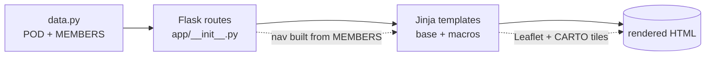

# `26.SUM.B.6` — a pod, rendered as a fleet

> A team portfolio for our MLH × Meta Production Engineering pod. The site is an
> **ops console for a fleet**: the pod is a cluster, each teammate is a service.
> Built with Flask + Jinja for Week 1 of the fellowship.

[](https://github.com/Builder106/MLH-Meta-PE-Portfolio/actions/workflows/ci.yml)
[](https://www.python.org/)
[](https://flask.palletsprojects.com/)
[](#license)
[](https://fellowship.mlh.io/programs/production-engineering)

## The idea

Week 1's rubric is a list of generic portfolio tasks (about, work, education,
hobbies, a travel map). Rather than fill the stock blue template, the whole site
is reframed as a **status page for a pod**:

- **`/`** — the **fleet overview**: every teammate listed as a service, with
  status, region, and a deploy count.
- **`/u/<handle>`** — a member's detail page, where the rubric rows become
  systems primitives:

  | Rubric task | Rendered as |
  | --- | --- |
  | Hero + photo | **Status header** — avatar, role / region, live clock |
  | About | **`whoami`** — a terminal block / service description |
  | Work experience | **`deploy.log`** — each role & project as a deployment |
  | Education | **build provenance** — where the build was compiled from |
  | Travel map | **edge network** — visited cities as Points of Presence |

- **`/ps_aux`** — a **fleet-wide** background-process view: everyone's hobbies as
  running processes, tagged by owner.

The menu bar and every member page are generated from one `MEMBERS` list, so
adding a teammate is a data edit, not a template change.

## Quickstart

```bash
python3 -m venv .venv
source .venv/bin/activate
pip install -r requirements.txt
flask run
```

Open <http://127.0.0.1:5000>. There's also a `/healthz` liveness probe that
returns the pod's status as JSON, because of course a fleet has one.

> The 2021-era template pinned Flask 2.0.1, which won't build on Python 3.12+.
> Dependencies were modernized to Flask 3.1 (tested on Python 3.14).

## How it works



- **`app/data.py`** holds `POD` plus a `MEMBERS` list. Each member is a dict with
  their about / experience / education / hobbies / places.
- **Routes** (`app/__init__.py`): `/` (fleet), `/u/<handle>` (member),
  `/ps_aux` (fleet hobbies), `/healthz`. The nav is built from `MEMBERS`.
- **`app/templates/macros.html`** holds reusable macros (`deploy_row`,
  `provenance_card`, `process_card`); pages just loop over the data.

## Project structure

```
app/
├── __init__.py          # Flask app, routes, MEMBERS-driven nav, 404 handler
├── data.py              # ← POD + MEMBERS (all content lives here)
├── static/
│   ├── img/             # site chrome: favicon, Apple icon, MLH logo
│   ├── photos/          # member avatars + hobby photos (your content)
│   └── styles/main.css  # the design system
└── templates/
    ├── base.html        # layout: dynamic nav + footer status bar
    ├── macros.html      # reusable Jinja macros for repeating sections
    ├── fleet.html       # / — the fleet overview
    ├── member.html      # /u/<handle> — a member's detail page
    ├── hobbies.html     # /ps_aux — fleet-wide background processes
    └── 404.html         # no-such-service page
```

## Adding yourself / contributing

This is a team repo — see **[CONTRIBUTING.md](CONTRIBUTING.md)**. The short
version: copy `MEMBER_TEMPLATE` in [`app/data.py`](app/data.py) into `MEMBERS`,
drop a square photo at `app/static/photos/<your-handle>.jpg`, and open a PR. You'll
get your own page and a nav tab automatically.

## License

[MIT](LICENSE) © the 26.SUM.B.6 pod
