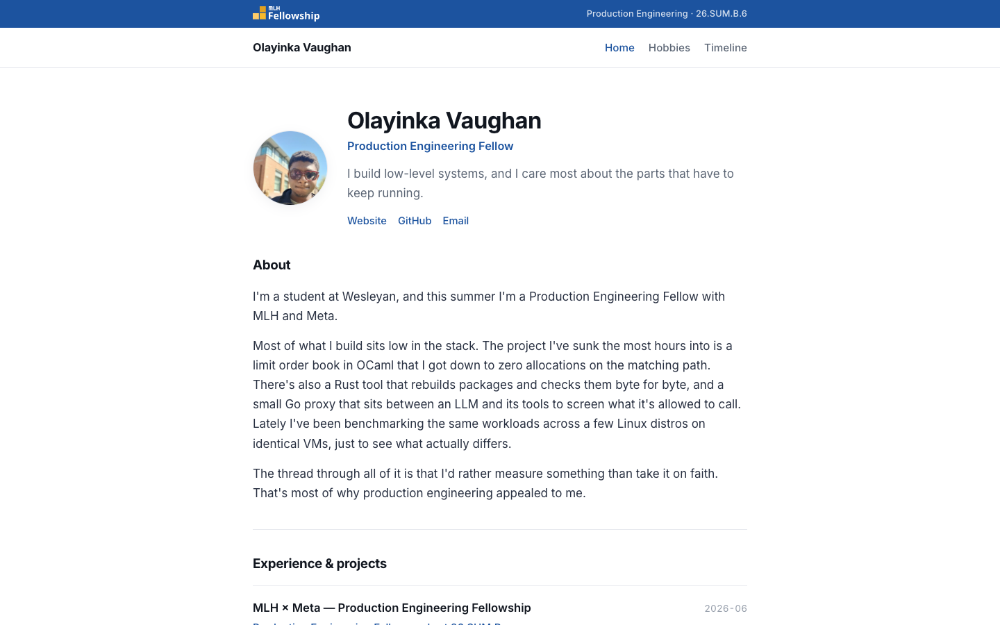
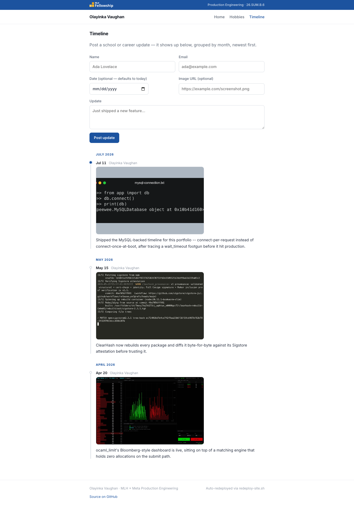
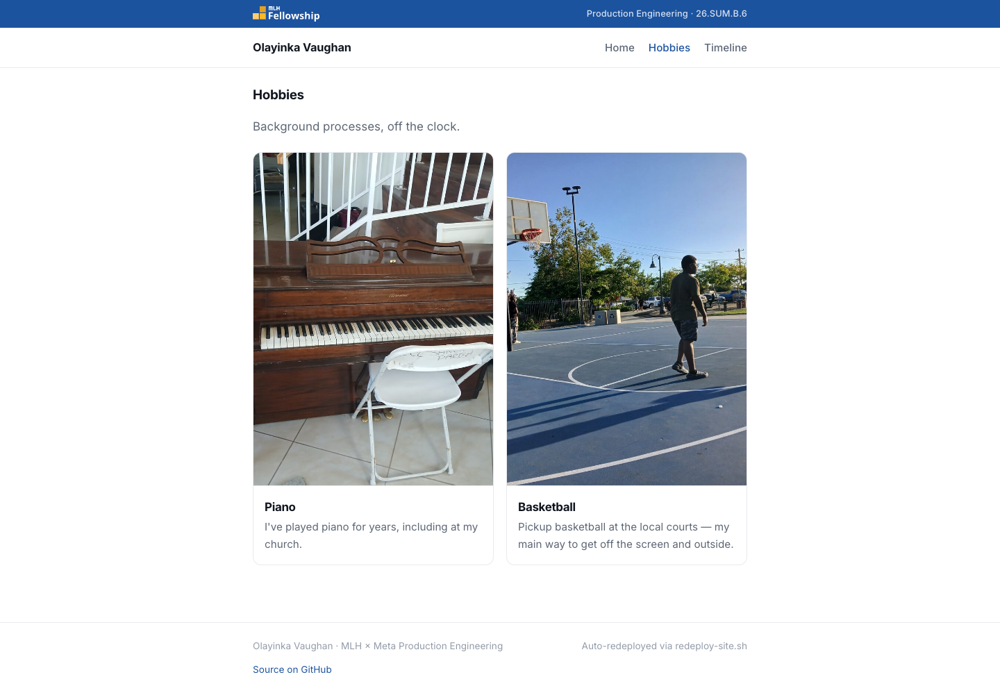
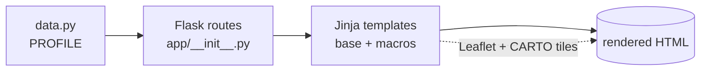

# Olayinka Vaughan — portfolio

> An individual portfolio for the MLH × Meta Production Engineering fellowship.
> Built with Flask + Jinja for Week 1 of the fellowship.

[](https://github.com/Builder106/MLH-Meta-PE-Portfolio/actions/workflows/ci.yml)
[](https://www.python.org/)
[](https://flask.palletsprojects.com/)
[](#license)
[](https://fellowship.mlh.io/programs/production-engineering)

## The idea

Week 1's tasks are a list of generic portfolio items (about, work, education,
hobbies, a travel map). This site renders each one as a systems primitive
instead of a plain page section:

| Rubric task | Rendered as |
| --- | --- |
| Hero + photo | **Status header** — avatar, role / region, live clock |
| About | **`whoami`** — a terminal block / service description |
| Work experience | **`deploy.log`** — each role & project as a deployment |
| Education | **build provenance** — where the build was compiled from |
| Travel map | **edge network** — visited cities as Points of Presence |

- **`/`** — the profile itself: status header, `whoami`, `deploy.log`, build
  provenance, edge network.
- **`/ps_aux`** — hobbies, rendered as background processes.

Everything the templates render lives in one `PROFILE` dict, so content edits
never need a template change.

## Preview

**`/`** — status header, `whoami`, `deploy.log`, build provenance, edge network:



**`/timeline`** — MySQL-backed public updates, grouped by month:



**`/ps_aux`** — hobbies rendered as background processes:



## Quickstart

```bash
python3 -m venv .venv
source .venv/bin/activate
pip install -r requirements.txt
flask run
```

Open <http://127.0.0.1:5000>. There's also a `/healthz` liveness probe that
returns the service's status as JSON, because of course a service has one.

> The 2021-era template pinned Flask 2.0.1, which won't build on Python 3.12+.
> Dependencies were modernized to Flask 3.1 (tested on Python 3.14).

## How it works



- **`app/data.py`** holds `PROFILE` — a single dict with about / experience /
  education / hobbies / places.
- **Routes** (`app/__init__.py`): `/` (home), `/ps_aux` (hobbies), `/timeline`,
  `/healthz`.
- **`app/templates/macros.html`** holds reusable macros (`experience_item`,
  `education_item`, `hobby_card`); pages just loop over the data.

## Project structure

```
app/
├── __init__.py          # Flask app, routes, 404 handler
├── data.py              # ← PROFILE (all content lives here)
├── static/
│   ├── img/             # site chrome: favicon, Apple icon, MLH logo
│   │   └── screenshots/ # README preview images
│   ├── photos/          # avatar + hobby photos (your content)
│   ├── timeline/        # images attached to /timeline posts
│   └── styles/main.css  # the design system
└── templates/
    ├── base.html        # layout: nav + footer status bar
    ├── macros.html      # reusable Jinja macros for repeating sections
    ├── home.html        # / — the profile
    ├── hobbies.html     # /ps_aux — background processes
    ├── timeline.html     # /timeline — school + career updates
    └── 404.html         # not-found page
```

## Contributing

See **[CONTRIBUTING.md](CONTRIBUTING.md)** for dev setup and how content is
wired — useful if you're adapting this template for your own fellowship
portfolio.

## License

[MIT](LICENSE) © Olayinka Vaughan
